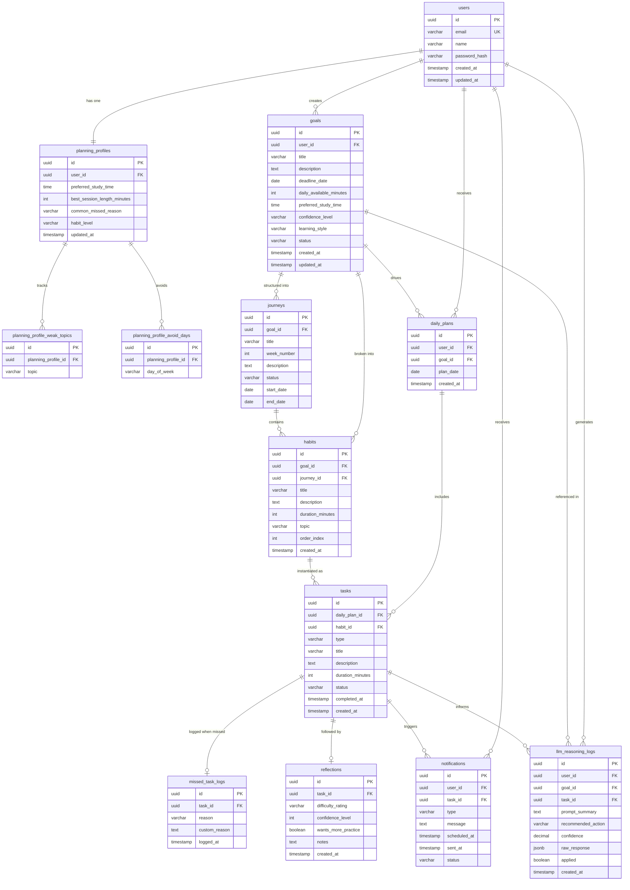

# Relational Database Diagram — Adaptive Interview Habit Coach

---

## Entity Reference

| Entity | Purpose |
|---|---|
| `users` | Core account. All data is scoped to a user. |
| `goals` | High-level objective with deadline, daily time, confidence level, and learning style collected at onboarding. |
| `planning_profiles` | One per user. Learned behavioural patterns used by the adaptive coach (preferred time, habit level, common missed reason). |
| `planning_profile_weak_topics` | Normalised list of topics the user struggles with (e.g. `etcd`, `scheduler`). |
| `planning_profile_avoid_days` | Days the coach should avoid scheduling heavy tasks (e.g. `Friday`). |
| `journeys` | Phased weekly sequence tied to a goal (e.g. "Week 2: Strengthen fundamentals"). |
| `habits` | Template-level small repeatable actions generated from a goal inside a journey. |
| `daily_plans` | One plan per user per goal per day. Groups the day's tasks. |
| `tasks` | Concrete scheduled instance of a habit. Holds the live status. |
| `missed_task_logs` | One-to-one with a missed task. Captures the reason for adaptive rescheduling. |
| `reflections` | Post-task self-assessment (difficulty, confidence, wants more practice). Feeds future planning. |
| `notifications` | Scheduled or sent messages. Non-guilt-based, tied to tasks or user context. |
| `llm_reasoning_logs` | Audit trail for every LLM call. `applied` tracks whether the backend accepted the recommendation. |

---

## Key Enums

| Field | Values |
|---|---|
| `goals.status` | `ACTIVE`, `COMPLETED`, `ABANDONED` |
| `goals.confidence_level` | `LOW`, `MEDIUM`, `HIGH` |
| `goals.learning_style` | `READING`, `PRACTICE`, `VISUAL`, `AUDIO` |
| `journeys.status` | `PENDING`, `IN_PROGRESS`, `COMPLETED` |
| `tasks.type` | `MAIN_HABIT`, `STRETCH_TASK`, `REFLECTION` |
| `tasks.status` | `PENDING`, `COMPLETED`, `MISSED`, `RESCHEDULED`, `SKIPPED` |
| `missed_task_logs.reason` | `TOO_BUSY`, `TOO_TIRED`, `FORGOT`, `TOO_HARD`, `TOO_LONG`, `NOT_MOTIVATED`, `PERSONAL_ISSUE`, `TOPIC_UNCLEAR`, `CUSTOM` |
| `reflections.difficulty_rating` | `TOO_EASY`, `RIGHT_LEVEL`, `TOO_HARD` |
| `notifications.type` | `HABIT_REMINDER`, `MISSED_FOLLOWUP`, `MOTIVATIONAL`, `SCHEDULE_ADJUSTMENT` |
| `notifications.status` | `PENDING`, `SENT`, `FAILED` |
| `planning_profiles.habit_level` | `STARTER`, `INTERMEDIATE`, `ADVANCED` |
